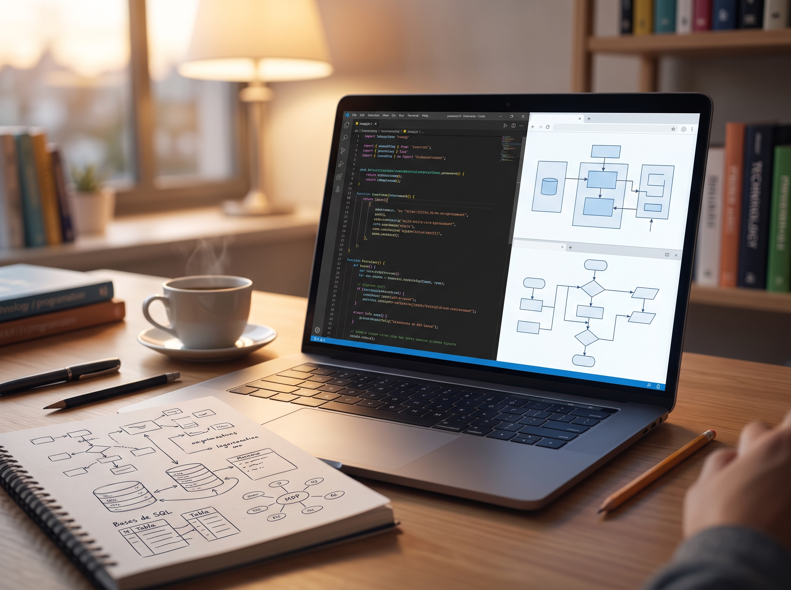

# README
Un pequeño repositorio de recursos para aprender programación y diversos temas relacionados, para reforzar o aprender cosas nuevas 😀

Contenido en español: ...

**Recursos :**
- [Libros de programación en español midudev](https://librosgratis.dev/)
- [Aprende Diseño de Sistemas](https://github.com/donnemartin/system-design-primer)
- [Proyectos roadmap ciberseguridad](https://github.com/carterperez-dev/cybersecurity-projects)
- [Micorsoft Aprender Rust](https://microsoft.github.io/RustTraining/)
- [Microsoft Aprender IA](https://github.com/microsoft/AI-For-Beginners/blob/main/translations/es/README.md)
- [Microsoft IA Generativa para principiantes](https://github.com/microsoft/generative-ai-for-beginners/blob/main/translations/es/README.md)
- [Algoritmos y Estructuras de Datos en python](https://github.com/thealgorithms/python)
- [Preparación para Entrevistas](https://github.com/jwasham/coding-interview-university)
- [Machine Learning Diseño de Sistemas](https://github.com/chiphuyen/machine-learning-systems-design)
- [Machine Learingin Preparación para entrevistas](https://github.com/iamarunbrahma/machine-learning-interview)
- [Libro Manual de Entrevistas Para Ingenieros de Software](https://github.com/iamarunbrahma/machine-learning-interview)
- [Aprender SQL](http://datalemur.com/sql-tutorial)
